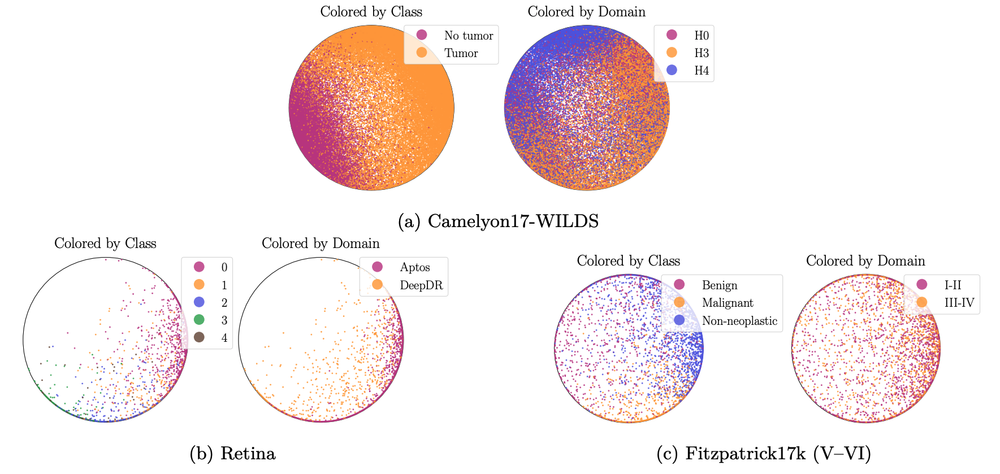

# HypCBC: Domain-Invariant Hyperbolic Cross-Branch Consistency for Generalizable Medical Image Analysis

<p align="center">
  
</p>

<p align="center">
    [<a href="https://openreview.net/forum?id=1spGpYmDjy">TMLR'26</a>]
    [<a href="https://arxiv.org/pdf/2602.03264">ArXiv</a>]
    [<a href="#citation">Citation</a>]
</p>


## Installation

This project uses `uv`.

Install `uv` (if needed):

```bash
pip install uv
```

Create/sync the environment from lockfile:

```bash
uv sync --frozen
```

## Entry Points

The project exposes two CLI entry points:

- `hypcbc-preprocess`: create embedding databases
- `hypcbc-train`: train/evaluate experiments

Equivalent Python module calls are:

```bash
uv run python hypcbc/preprocessing.py ...
uv run python hypcbc/main.py ...
```

## Preprocessing (Create Embedding DB)

Minimal run:

```bash
uv run hypcbc-preprocess --config config/create_db.yaml
```

With inline overrides:

```bash
dataset="camelyon17"
backbone="dinov2_small"
uv run hypcbc-preprocess --config config/create_db.yaml \
  --set data.dataset="$dataset" \
  --set model.backbone_id="$backbone"
```

## Train / Evaluate

Minimal `baseline` run:

```bash
uv run hypcbc-train --config config/baseline.yaml
```

Euclidean example:

```bash
uv run hypcbc-train --config config/baseline.yaml \
  --set model.manifold=euc
```

Hyperbolic example:

```bash
uv run hypcbc-train --config config/baseline.yaml \
  --set model.manifold=hyp \
```

Hyperbolic distillation example:

```bash
uv run hypcbc-train --config config/baseline.yaml \
  --override config/methods/dist.yaml \
  --set model.manifold=hyp \
  --set model.branch1_dim=128 \
  --set model.branch2_dim=2
```

## Path Reference

- Base configs: `config/*.yaml`
- Method overrides: `config/methods/*.yaml`
- Main CLIs: `hypcbc/main.py`, `hypcbc/preprocessing.py`

## Code Structure

High-level package layout:

- `hypcbc/main.py`: training/evaluation CLI entry.
- `hypcbc/preprocessing.py`: embedding-database creation CLI entry.
- `hypcbc/config/`: typed config models and config merge/override logic.
- `hypcbc/data/`: datamodule + dataset/transform builders and dataset registries.
- `hypcbc/dataset/`: dataset implementations and wrappers.
- `hypcbc/model/`: model module, losses, trainer, and model registry.
- `hypcbc/hyptorch/`: hyperbolic layers/ops used by the model.
- `hypcbc/helper.py`: common utilities (seeding, config printing, run-id helpers).

Typical flow:

1. Precompute embeddings with `hypcbc-preprocess`.
2. Train/evaluate with `hypcbc-train`.

## Quick Sanity Checks

Check CLIs parse correctly:

```bash
uv run hypcbc-preprocess --help
uv run hypcbc-train --help
```

## Citation

If you use this code in your research, please cite:

```
@article{disalvo2026hypcbc,
title={Hyp{CBC}: Domain-Invariant Hyperbolic Cross-Branch Consistency for Generalizable Medical Image Analysis},
author={Francesco Di Salvo and Sebastian Doerrich and Jonas Alle and Christian Ledig},
journal={Transactions on Machine Learning Research},
issn={2835-8856},
year={2026},
url={https://openreview.net/forum?id=1spGpYmDjy},
}
```

## License

Apache-2.0
